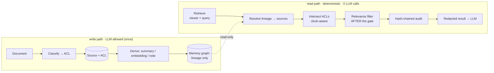

<div align="center">

# 🧅 Onion Loop Memory Guard

### Permission-aware memory for AI agents — deterministic access, governed by lineage, proven by audit.

**Secure memory. Deterministic access. Accountable AI.**

`retrieval-layer enforcement` · `0 LLM calls on the decision path` · `revocation by lineage` · `hash-chained audit`

Built for the **BasedAI Permission-Aware Memory Challenge** — *UK AI Agent Hackathon Ep5 × Conduct*

</div>

---

## The problem, in one breath

AI agents remember, summarise, and act across everything a company owns. But
today's memory systems (RAG) retrieve by **relevance** and bolt permissions on in
the **application layer** — so an AI-generated summary happily leaks what its
source document protected, embeddings expose restricted knowledge, and when
someone's access changes, stale permissions linger. There is no audit trail a
regulator would accept.

**Onion Loop Memory Guard is the safety layer agents need before an enterprise
can trust them.** Access is *computed from the source graph at read time* — never
copied onto a memory, and **never decided by an LLM**. Revoke a source and every
summary, embedding and note derived from it recomputes to "no access" in the same
breath.

> Not a chatbot. Not a wrapper. **A deterministic governance layer for agent memory.**

<div align="center">

</div>

---

## Quickstart — one command

```bash
npm run demo        # → http://localhost:4173
```

No dependencies to install — the whole engine runs on the Node standard library.
Prefer Make or Docker?

```bash
make demo                 # same thing
docker compose up --build # containerised, health-checked
```

Then **revoke a source** in the console and watch its AI-generated summaries
vanish for everyone, with an audit entry explaining why. Full walkthrough:
[docs/DEMO-SCRIPT.md](docs/DEMO-SCRIPT.md).

Verify the claims yourself:

```bash
node --test          # 31 invariant tests (deterministic, revocation, temporal, audit, inference)
node bench/p99.js    # sub-200ms P99 — prints ~0.38µs, ~500,000× under budget
```

---

## What makes it different

| | Typical RAG memory | Onion Loop Memory Guard |
|---|---|---|
| Where access is enforced | Application layer, after retrieval | **Retrieval layer, before relevance ranking** |
| Who decides visibility | Often the LLM ("only use allowed docs") | **Pure computation — 0 LLM calls, reproducible** |
| Derived memory (summaries/embeddings) | Inherits nothing; leaks source content | **Inherits source ACLs by lineage (intersection)** |
| Revoking a source | Hunt & invalidate cached permissions | **Nothing to invalidate — next read is ∅** |
| Audit | Ad-hoc logs, editable | **Hash-chained, tamper-evident, HCS-anchored** |
| Latency | Varies (model in loop) | **Sub-microsecond P99** |

---

## How it works

Two paths. Only the **write path** may touch an LLM (once, to classify a source).
The **read path** is pure computation.



The core rule, and the reason revocation is free:

> **You may read a derived memory iff you may read _every_ source in its lineage.**
> Its audience is never stored — only recomputed. So there is no cache to go stale.

Deep dive with sequence + lineage diagrams: **[docs/ARCHITECTURE.md](docs/ARCHITECTURE.md)**.

---

## The demo scenario

Four ACL'd sources, four AI-derived memories, four personas. The full truth table
([`scenarios/decision-matrix.json`](scenarios/decision-matrix.json)):

| Derived memory | Lineage → requirement | Alice `board` | Dana `board+eng` | Bob `eng` | Carol `contractor` |
|---|---|:-:|:-:|:-:|:-:|
| **MEM-01** Summary · Q3 perf | board deck + public blog → `board` | ✅ | ✅ | ⛔ | ⛔ |
| **MEM-02** Embedding · blog | public blog → `everyone` | ✅ | ✅ | ✅ | ✅ |
| **MEM-03** Note · infra↔board | board deck + infra runbook → `board ∧ eng` | ⛔ | ✅ | ⛔ | ⛔ |
| **MEM-04** Summary · leadership | leadership call → `∅ until +30d, then board` | ⏳ | ⏳ | ⛔ | ⛔ |

Revoke the Q3 board deck → **MEM-01 and MEM-03 drop for everyone**. Advance the
clock 30 days → **MEM-04 unlocks** under normal ACLs. Both driven by the same
engine, in the browser and on the server.

---

## Meeting the brief

Every bounty requirement, mapped to code, tests and proof, in
**[docs/JUDGING-NOTES.md](docs/JUDGING-NOTES.md)**. In short:

- ✅ **Retrieval-layer enforcement, deterministic** — no LLM on the decision path
- ✅ **Lineage-governed derived memory** — audience = per-source intersection
- ✅ **Revocation propagates** — no cache; next read is correct
- ✅ **Regulatory audit** — hash-chained, tamper-evident, HCS-anchored
- ✅ **Sub-200ms P99** — measured at ~0.38µs
- ✅ **Bonus: temporal access rules** — "unlock after 30 days"
- ✅ **Bonus: query-time inference prevention** — denied nodes leave as opaque tombstones ([scope stated honestly](docs/SECURITY-MODEL.md))

---

## Project layout

```
src/            the engine — dependency-free ES modules (one source of truth)
  audience.js     access algebra: intersect, personaAllowed
  engine.js       lineage resolution + temporal rules + the decision
  audit.js        hash-chained, HCS-anchored ledger
  inference.js    bonus: redacted views + leak self-audit
  scenario.js     the canonical demo world
web/            the Clearance Console — imports src/ directly (zero build)
server/         dependency-free Node host: serves the console + JSON API
test/           31 invariant tests (node:test)
bench/          the P99 benchmark
scenarios/      JSON scenario, decision matrix, sample audit + retrieve outputs
docs/           ARCHITECTURE · SECURITY-MODEL · FIELD-NOTES · DEMO-SCRIPT · JUDGING-NOTES
```

The browser console, the API server, the tests and the benchmark all import the
**same** `src/` modules. There is one enforcement implementation, not four — when
a test passes, the thing on screen is the thing that passed.

## API (server-side, same engine)

```bash
curl "http://localhost:4173/api/retrieve?as=carol"   # deterministic redacted view for a persona
curl "http://localhost:4173/api/audit"               # ledger + chain verification + P99
curl "http://localhost:4173/api/scenario"            # sources, derived memories, personas
```

---

## Roadmap

- **Middleware + SDK** — drop-in `retrieve()` gate for LangChain / LlamaIndex / MCP memory tools
- **Pluggable stores** — back the graph with SpiceDB (ReBAC) and a real vector index; SHA-256 audit hashing
- **Live Hedera HCS anchoring** — replace the simulated anchor with real testnet topic submission ([backend already live](https://github.com/phoenicon))
- **Canton settlement** — governed, privacy-preserving institutional workflows for regulated deployments (finance, health, RWA)
- **Content-level inference auditing** — the honest open problem (see [SECURITY-MODEL.md](docs/SECURITY-MODEL.md))

## Why I built it

Enterprise AI cannot safely scale until agent memory is governed with the same
rigor as the underlying data — in finance, health, government, and the
real-world-asset tokenisation work I do at [Tokenise.Farm](https://tokenise.farm).
The engineering lessons that shaped this build are in
**[docs/FIELD-NOTES.md](docs/FIELD-NOTES.md)**.

## License

[MIT](LICENSE) © 2026 Colin Porter ([@phoenicon](https://github.com/phoenicon))
