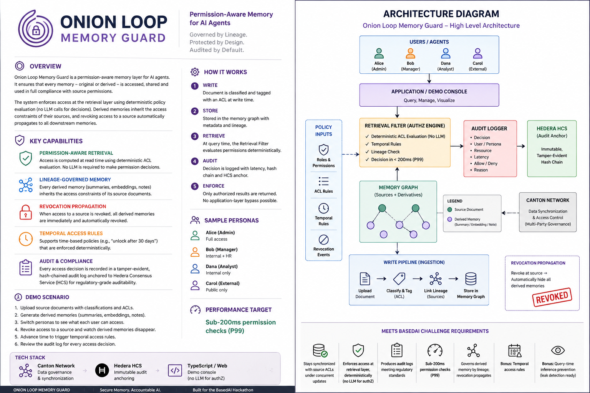
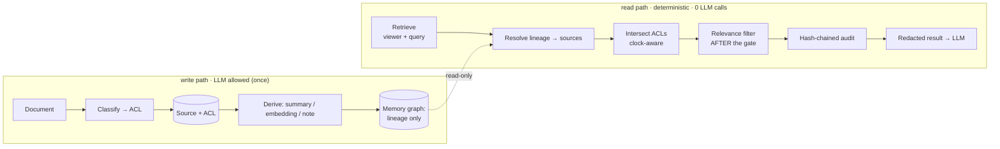

<div align="center">

# 🧅 Onion Loop Memory Guard

### Permission-aware memory for AI agents — deterministic access, governed by lineage, proven by audit.

**Secure memory. Deterministic access. Accountable AI.**

`retrieval-layer enforcement` · `0 LLM calls on the decision path` · `revocation by lineage` · `hash-chained audit`

Built for the **BasedAI Permission-Aware Memory Challenge** — *UK AI Agent Hackathon Ep5 × Conduct*

**▶ Live, no install:** [📚 the library](https://phoenicon.github.io/onion-loop-memory-guard/web/library.html) · [🎛️ the console](https://phoenicon.github.io/onion-loop-memory-guard/web/index.html) · [🎬 60s reel](https://phoenicon.github.io/onion-loop-memory-guard/web/reel.html)

</div>

---

## The problem, in one breath

AI agents remember, summarise, and act across everything a company owns. But
today's memory systems (RAG) retrieve by **relevance** and bolt permissions on in
the **application layer** — so an AI-generated summary happily leaks what its
source document protected, embeddings expose restricted knowledge, and when
someone's access changes, stale permissions linger. There is no audit trail a
regulator would accept.

**Onion Loop Memory Guard is the safety layer agents need before an enterprise
can trust them.** Access is *computed from the source graph at read time* — never
copied onto a memory, and **never decided by an LLM**. Revoke a source and every
summary, embedding and note derived from it recomputes to "no access" in the same
breath.

> Not a chatbot. Not a wrapper. **A deterministic governance layer for agent memory.**

<div align="center">

</div>

> 📚 **New here? Start with the library.** Open [`web/library.html`](web/library.html)
> in a browser (it's self-contained — no install) for a 30-second, illustrated
> walkthrough: public books, a secret book, an AI summary that inherits their
> permissions, and a tamper-evident receipt. Then dive into the technical console.

---

## Quickstart — one command

```bash
npm run demo        # → http://localhost:4173
```

No dependencies to install — the whole engine runs on the Node standard library.
Prefer Make or Docker?

```bash
make demo                 # same thing
docker compose up --build # containerised, health-checked
```

Then **revoke a source** in the console and watch its AI-generated summaries
vanish for everyone, with an audit entry explaining why. Full walkthrough:
[docs/DEMO-SCRIPT.md](docs/DEMO-SCRIPT.md).

Verify the claims yourself:

```bash
node --test          # 39 invariant tests (deterministic, revocation, temporal, audit, inference, concurrency, vector-gate)
node bench/p99.js    # sub-200ms P99 — prints ~0.38µs, ~500,000× under budget
npm run vector       # the gate in front of a REAL embedding + similarity search
npm run eli5         # the whole idea narrated in 30 seconds
```

### The gate in front of a real vector search

`npm run vector` runs an end-to-end retrieval: it embeds a corpus, does a genuine
cosine **nearest-neighbour search**, then runs the *same engine* over the hits.
The point it makes: similarity search will happily rank a **confidential board
deck as the #1 hit** for a budget query — so relevance can't be trusted to decide
visibility. The gate drops it for a contractor and keeps it for a board member,
deterministically, *after* the search. Embeddings use a dependency-free local
embedder by default, or OpenAI `text-embedding-3-small` if `OPENAI_API_KEY` is
set; swap the store for Pinecone/pgvector without touching the gate.

---

## What makes it different

| | Typical RAG memory | Onion Loop Memory Guard |
|---|---|---|
| Where access is enforced | Application layer, after retrieval | **Retrieval layer, before relevance ranking** |
| Who decides visibility | Often the LLM ("only use allowed docs") | **Pure computation — 0 LLM calls, reproducible** |
| Derived memory (summaries/embeddings) | Inherits nothing; leaks source content | **Inherits source ACLs by lineage (intersection)** |
| Revoking a source | Hunt & invalidate cached permissions | **Nothing to invalidate — next read is ∅** |
| Audit | Ad-hoc logs, editable | **Hash-chained, tamper-evident, HCS-anchored** |
| Latency | Varies (model in loop) | **Sub-microsecond P99** |

---

## How it works

Two paths. Only the **write path** may touch an LLM (once, to classify a source).
The **read path** is pure computation.



The core rule, and the reason revocation is free:

> **You may read a derived memory iff you may read _every_ source in its lineage.**
> Its audience is never stored — only recomputed. So there is no cache to go stale.

Deep dive with sequence + lineage diagrams: **[docs/ARCHITECTURE.md](docs/ARCHITECTURE.md)**.

---

## The demo scenario

Four ACL'd sources, four AI-derived memories, four personas. The full truth table
([`scenarios/decision-matrix.json`](scenarios/decision-matrix.json)):

| Derived memory | Lineage → requirement | Alice `board` | Dana `board+eng` | Bob `eng` | Carol `contractor` |
|---|---|:-:|:-:|:-:|:-:|
| **MEM-01** Summary · Q3 perf | board deck + public blog → `board` | ✅ | ✅ | ⛔ | ⛔ |
| **MEM-02** Embedding · blog | public blog → `everyone` | ✅ | ✅ | ✅ | ✅ |
| **MEM-03** Note · infra↔board | board deck + infra runbook → `board ∧ eng` | ⛔ | ✅ | ⛔ | ⛔ |
| **MEM-04** Summary · leadership | leadership call → `∅ until +30d, then board` | ⏳ | ⏳ | ⛔ | ⛔ |

Revoke the Q3 board deck → **MEM-01 and MEM-03 drop for everyone**. Advance the
clock 30 days → **MEM-04 unlocks** under normal ACLs. Both driven by the same
engine, in the browser and on the server.

---

## Meeting the brief

Every bounty requirement, mapped to code, tests and proof, in
**[docs/JUDGING-NOTES.md](docs/JUDGING-NOTES.md)**. In short:

- ✅ **Retrieval-layer enforcement, deterministic** — no LLM on the decision path
- ✅ **Lineage-governed derived memory** — audience = per-source intersection
- ✅ **In sync with source ACLs under concurrent updates** — permissions are *never cached* on derived memories; every retrieval recomputes effective access directly from current source ACLs. This **deletes the TOCTOU** (Time-of-Check-to-Time-of-Use) class that plagues cache-based RAG permissioning: there is no stale-permission window to exploit. *Demonstrated* by an interleaved concurrency stress test ([`test/concurrency.test.js`](test/concurrency.test.js): 12,000+ reads against live mutations, zero stale grants)
- ✅ **Regulatory audit** — hash-chained, tamper-evident, HCS-anchored, with timestamps + decision reasons
- ✅ **Sub-200ms P99** — measured at ~0.38µs
- ✅ **Bonus: temporal access rules** — "unlock after 30 days"
- ✅ **Bonus: query-time inference prevention** — two honest layers: (1) denied results leave as opaque **tombstones** (no metadata side-channel), and (2) a **cross-document reconstruction auditor** that flags when the union of a viewer's granted memories' lineage would let them reconstruct a denied one. Content-level *statistical* inference is explicitly out of scope — [stated plainly](docs/SECURITY-MODEL.md), not oversold

---

## Project layout

```
src/            the engine — dependency-free ES modules (one source of truth)
  audience.js     access algebra: intersect, personaAllowed
  engine.js       lineage resolution + temporal rules + the decision
  audit.js        hash-chained, HCS-anchored ledger
  inference.js    bonus: redacted views + leak self-audit
  vector.js       real embeddings + cosine store (the gate runs in front of it)
  scenario.js     the canonical demo world
web/            the Clearance Console — imports src/ directly (zero build)
server/         dependency-free Node host: serves the console + JSON API
test/           31 invariant tests (node:test)
bench/          the P99 benchmark
scenarios/      JSON scenario, decision matrix, sample audit + retrieve outputs
docs/           ARCHITECTURE · SECURITY-MODEL · FIELD-NOTES · DEMO-SCRIPT · JUDGING-NOTES
```

The browser console, the API server, the tests and the benchmark all import the
**same** `src/` modules. There is one enforcement implementation, not four — so
there are **no bypass loops** between what the browser shows and what the server
enforces. When a test passes, the thing on screen is the thing that passed.

## API (server-side, same engine)

```bash
curl "http://localhost:4173/api/retrieve?as=carol"                 # deterministic redacted view for a persona
curl "http://localhost:4173/api/search?as=carol&q=harvest+budget"  # REAL embedding + cosine search, then gated
curl "http://localhost:4173/api/audit"                             # ledger + chain verification + P99
curl "http://localhost:4173/api/scenario"                          # sources, derived memories, personas
```

`/api/search` embeds the query, runs a real nearest-neighbour search, and gates
the hits — so you can watch a confidential doc rank #1 yet never reach an
uncleared viewer, over HTTP.

## Deploy (run it online)

Zero dependencies, so hosting is trivial — any Node host works.

[](https://render.com/deploy?repo=https://github.com/phoenicon/onion-loop-memory-guard)

- **Render** (one click): use the button above, or New **+** → **Blueprint** → connect this repo. [`render.yaml`](render.yaml) does the rest; health check at `/api/health`.
- **Anything with Node** (Railway / Fly / a VPS): `npm start` (serves the console, library, and API on `$PORT`).
- **Static only** (GitHub Pages / any web space): the [library](web/library.html) and [console](web/index.html) run fully in the browser — no server needed. Only the `/api/*` routes require a Node host.
- **Embeddings**: local + zero-key by default; set `OPENAI_API_KEY` for `text-embedding-3-small`.

---

## Roadmap

- **Middleware + SDK** — drop-in `retrieve()` gate for LangChain / LlamaIndex / MCP memory tools
- **Pluggable stores** — the gate already runs in front of a real embedding + cosine search ([`src/vector.js`](src/vector.js), `npm run vector`); next: back it with SpiceDB (ReBAC) + Pinecone/pgvector at scale, and SHA-256 audit hashing
- **Live Hedera HCS anchoring** — replace the simulated anchor with real testnet topic submission ([backend already live](https://github.com/phoenicon))
- **Canton settlement** — governed, privacy-preserving institutional workflows for regulated deployments (finance, health, RWA)
- **Content-level inference auditing** — the honest open problem (see [SECURITY-MODEL.md](docs/SECURITY-MODEL.md))

## Why I built it

Enterprise AI cannot safely scale until agent memory is governed with the same
rigor as the underlying data — in finance, health, government, and the
real-world-asset tokenisation work I do at [Tokenise.Farm](https://tokenise.farm).
The engineering lessons that shaped this build are in
**[docs/FIELD-NOTES.md](docs/FIELD-NOTES.md)**.

## License

[MIT](LICENSE) © 2026 Colin Porter ([@phoenicon](https://github.com/phoenicon))
