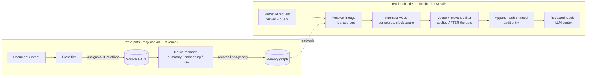
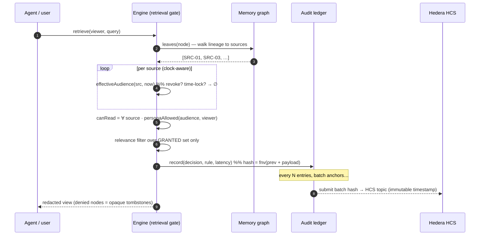
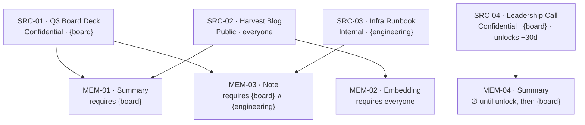

# Architecture

Onion Loop Memory Guard is a **retrieval-layer enforcement engine**. The design
goal is one sentence: *access is computed from the source graph at read time —
never copied onto a derivative, and never decided by a model.*

Everything below serves that sentence.

---

## The two paths

There are exactly two paths through the system. Only the **write path** is ever
allowed to touch an LLM; the **read path** is pure computation.

The classifier can be as smart as you like — it runs at **write time**, offline,
and its only job is to attach ACL relations to a source. Once written, the
source's access is data. The read path never asks a model "should this be
visible?"; it *derives* the answer.

---

## Enforcement, step by step

A single retrieval, from request to redacted result:

Two things worth calling out:

1. **The gate runs before relevance.** We never rank-then-filter; we
   filter-then-rank. A memory the viewer can't read is never a candidate, so it
   cannot leak through "top-k" scoring.
2. **Denied nodes leave as tombstones.** The result carries `{id, visible:false}`
   and nothing else — no title, no lineage, no "requires {board}" hint. See
   [SECURITY-MODEL.md](SECURITY-MODEL.md) for why that matters.

---

## Lineage governance (the "onion loop")

Every derived memory stores **only** its lineage — the sources it came from. Its
audience is recomputed on every read as the per-source intersection:

> You may read a derivative **iff** you may read **every** source in its lineage.

This is what makes revocation *free*: there is nothing to invalidate. Set
`SRC-01.revoked = true` and, on the very next read, `MEM-01` and `MEM-03` resolve
to ∅ for everyone — because their audience was never stored, only derived.

---

## Module map

| Module | Responsibility | LLM? |
|---|---|:-:|
| [`src/audience.js`](../src/audience.js) | The access algebra — `intersect`, `personaAllowed` | no |
| [`src/engine.js`](../src/engine.js) | Lineage resolution + temporal rules + the decision | no |
| [`src/audit.js`](../src/audit.js) | Hash-chained, HCS-anchored decision ledger | no |
| [`src/inference.js`](../src/inference.js) | Bonus: redacted views + leak self-audit | no |
| [`src/scenario.js`](../src/scenario.js) | The canonical demo world (shared by demo/tests/bench) | no |
| `(your classifier)` | Write-time ACL assignment | **yes, once** |

The engine is ~300 lines of dependency-free ES modules. The browser console, the
Node API server, the test suite and the benchmark all import the **same** files —
there is one enforcement implementation, not four.

---

## Where the ledger settles

The audit ledger is tamper-evident on its own (any edit breaks the hash chain;
`verifyChain` finds the exact seam). Anchoring to **Hedera Consensus Service**
adds an *independent* immutable timestamp so the log's integrity does not rest on
trusting the operator. This is the "optional ledger settlement" layer — the
system is fully functional without it, and stronger with it. Canton concepts
(governed, privacy-preserving workflows) are the natural home for the
institutional deployment; see the roadmap in the [README](../README.md#roadmap).
